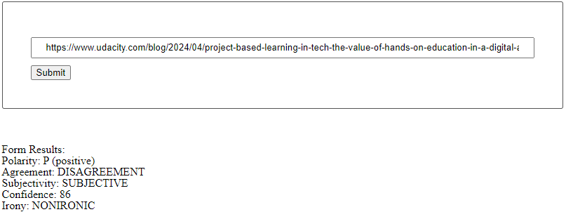
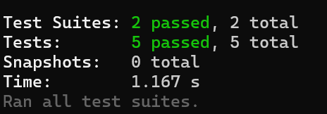

# Udacity project submission - Evaluate News Article with Natural Language Processing

This project creates a simple client-server NodeJs app that passes a URL to [MeaningCloud API](https://www.meaningcloud.com/).

## How to run the development app

- Use node: `nvm use node`
- Install all packages: `npm install`
- Setup server: `npm run start`
  - To test if server runs: Go to `http://localhost:8000`
- Setup client (dev): `npm run build-dev`

Then go to `http://localhost:3000` and pass in a URL e.g.

```
https://www.udacity.com/blog/2024/04/project-based-learning-in-tech-the-value-of-hands-on-education-in-a-digital-age.html
```

You should get the following output:



## How to run the production app

Same as above, but instead of running `npm run build-dev` run the following commands:

- `npm run build-prod`
- `npm run serve`

The first command will create files in the `dist/` directory and the second command will serve them on `http://localhost:3000`.

## How to test

Testing is done with [Jest](https://jestjs.io/). Run the following command to run the test suites:

```
npm run test
```

You should get an output showing all tests ran successfully:


